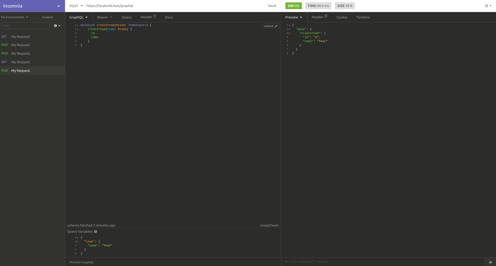
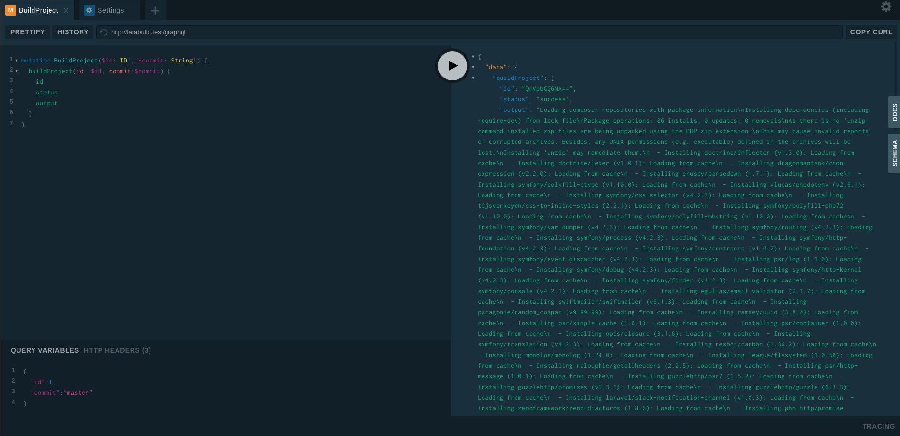

# LaraBuild

CI / CD server running on Laravel with a GraphQL API. Built for [LaraHack #3 2019](https://larahack.com).

Table of Contents
=================

   * [LaraBuild](#larabuild)
   * [Table of Contents](#table-of-contents)
      * [Installation](#installation)
      * [Workflow](#workflow)
         * [Prepare project repository](#prepare-project-repository)
         * [Create entities](#create-entities)
            * [Create a team](#create-a-team)
            * [Create a project](#create-a-project)
            * [Build a project](#build-a-project)
      * [Roles](#roles)
      * [Schema](https://github.com/datashaman/larabuild/wiki/Schema)
      * [Screenshots](#screenshots)
      * [TODO](#todo)
      * [License](#license)

## Installation

Setup a MySQL database and user for access.

Clone repository:

    git clone https://github.com/datashaman/larabuild.git

Install the composer dependencies:

    composer install

Edit the .env to your requirements.

Migrate the database (optionally seed with demo data):

    php artisan migrate

Create an admin user:

    php artisan larabuild:user name email password --roles=ADMIN

Get the user's access token:

    php artisan larabuild:access-token [--id=userId] [--email=userEmail]

Either `id` or `email` must be specified.

Assuming you use valet, open the [GraphQL playground](http://larabuild.test/graphql-playground).

Edit the _HTTP HEADERS_ and add an _Authorization_ header:

    {
        "Authorization": "Bearer token"
    }

Replace the word `token` with the output from the access token command above.

If you use a client other than playground, you might have to add another header:

    {
        "X-Requested-With": "XMLHttpRequest"
    }

Congratulations, you're connected to the GraphQL API!

## Workflow

### Prepare project repository

Create a private key for the deploy user:

    ssh-keygen

When prompted save the file locally in your folder somwewhere. Assuming you called it _larabuild_, it will generate _larabuild_ and _larabuild.pub_.

Create a new _deploy key_ (under Settings / Deploy Keys on _GitHub_) in the project repository, and paste the contents of _larabuild.pub_ into the form.

Add, commit and push a file to the project repository named `.larabuild.yml` containing the following content:

    install:
        - ['echo', 'hello world']

You must use list format for the command if you are using _docker_ execution. Local execution (the default) commands can be specified as strings.

### Create entities

Example queries are shown as pseudo-JSON. Put the query and variables wherever they should go in your GraphQL client.

#### Create a team

Create a team to hold our project:

    {
        "query": "
            mutation createTeam($team: TeamInput!) {
                createTeam(team: $team) {
                    id
                    name
                }
            }
        ",
        "variables": {
            "id": "example-team",
            "name": "Example Team"
        }
    }

will respond with:

    {
        "data": {
            "createTeam": {
                "id": "example-team",
                "name": "Example Team"
            }
        }
    }

#### Create a project

Use the `id` from above in `teamId` and the content of the private key file _larabuild_ for `privateKey` below to create a project:

    {
        "query": "
            mutation createProject($project: CreateProjectInput!) {
                createProject(project: $project) {
                    id
                    team {
                        id
                        name
                    }
                    name
                    repository
                }
            }
        ",
        "variables": {
            "teamId": teamId,
            "id": "example-project",
            "name": "Example Project",
            "repository": "https://github.com/user/repository.git",
            "privateKey": privateKey
        }
    }

This will return a JSON response including the project `id`:

    {
        "data": {
            "createProject": {
                "id": "example-project",
                "team": {
                    "id": "example-team",
                    "name": "Example Team"
                },
                "name": "Example Project",
                "repository": "https://github.com/user/repository.git"
            }
        }
    }

#### Build a project

We will now generate our first build.  As an admin user, you can build projects in any team. Use the `projectId` from above:

    {
        "query": "
            mutation buildProject($id: ID!, $commit: String!) {
                buildProject(id: $id, commit: $commit) {
                    id
                    number
                    status
                    output
                }
            }
        ",
        "variables": {
            "id": projectId,
            "commit": "master"
        }
    }

The commands in the `install` value from `.larabuild.yml` file in the project repository will run and the build output and status will be shown as a JSON response:

    {
        "data": {
            "buildProject": {
                "id": "QnVpbGQ6NA==",
                "number": 1,
                "status": "success",
                "output": "hello world\n"
            }
        }
    }

If any of the commands listed fails during the process, the build has a status of `failed`.

If no `.larabuild.yml` file is found, the build has a status of `not-found`. While the job is running, the status is `started`.

Look at the [feature tests](tests/Feature) for how to use the rest of the GraphQL API, or consult the introspected documentation in your GraphQL client.

## Roles

Regular users (no role)
    
- can belong to many teams
- cannot administer teams or their projects
- can view their teams, projects and builds
- can build projects in their teams

Team admin users (`TEAM_ADMIN` role)

- can update the team
- can create, update and delete projects
- can create and update users

Admin users (`ADMIN` role)

- can access everything
- can add and remove roles from users

## Screenshots

## TODO

All the current _TODO_ items have been logged as [issues](https://github.com/datashaman/larabuild/issues).

## License

    MIT License

    Copyright (c) 2019 Marlin Forbes

    Permission is hereby granted, free of charge, to any person obtaining a copy
    of this software and associated documentation files (the "Software"), to deal
    in the Software without restriction, including without limitation the rights
    to use, copy, modify, merge, publish, distribute, sublicense, and/or sell
    copies of the Software, and to permit persons to whom the Software is
    furnished to do so, subject to the following conditions:

    The above copyright notice and this permission notice shall be included in all
    copies or substantial portions of the Software.

    THE SOFTWARE IS PROVIDED "AS IS", WITHOUT WARRANTY OF ANY KIND, EXPRESS OR
    IMPLIED, INCLUDING BUT NOT LIMITED TO THE WARRANTIES OF MERCHANTABILITY,
    FITNESS FOR A PARTICULAR PURPOSE AND NONINFRINGEMENT. IN NO EVENT SHALL THE
    AUTHORS OR COPYRIGHT HOLDERS BE LIABLE FOR ANY CLAIM, DAMAGES OR OTHER
    LIABILITY, WHETHER IN AN ACTION OF CONTRACT, TORT OR OTHERWISE, ARISING FROM,
    OUT OF OR IN CONNECTION WITH THE SOFTWARE OR THE USE OR OTHER DEALINGS IN THE
    SOFTWARE.

Add a line
